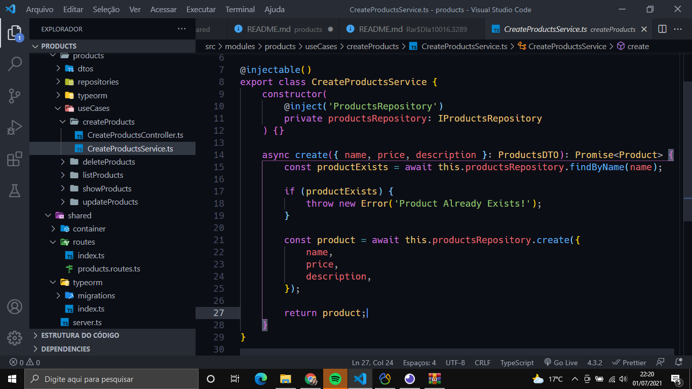

<h1 align="center">CRUD NodeJS</h1>

    

## 💻 Projeto

Esse projeto tem o objetivo de criar uma api simples de um CRUD de produtos em NodeJS usando Express, Typeorm e MySQL.

## ✨ Tecnologias

Esse projeto foi desenvolvido com as seguintes tecnologias:

-   [Node.js](https://nodejs.org/en/)
-   [Typescript](https://www.typescriptlang.org/)
-   [Express](https://expressjs.com/pt-br/)
-   [Typeorm](https://typeorm.io/#/)

## 🚀 Instalação e Configuração do Projeto

1. Criar um Banco de Dados com o Nome: `products`

2. Instale as Dependências: `npm install`

3. Execute as Migrations: `npm typeorm migrations:run`

4. Execute a API: `npm dev`

Por fim, a aplicação estará disponível em `http://localhost:3333`

---

Feito com ❤ &nbsp;by Aiandra Meira 👋🏻 &nbsp;[Portfólio Pessoal](https://aiandralves.com.br)
